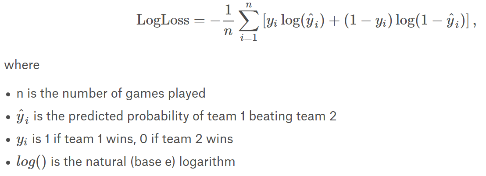

# Machine Learning Engineer Nanodegree
## Capstone Proposal
Matthew McFalls 
March 17th, 2019

## Using Machine Learning to Predict the NCAA March Madness Results

### Domain Background
Since 1939, the National Collegiate Athletic Association (NCAA) has held a single elimination basketball tournament, composed of the teams from the Division I level, to determine the national collegiate champion.  This tournament is known as March Madness.  Every year people create their personal brackets to determine which teams will ultimately advance to the final game and which team will win the final game.  Machine learning has been slowly applied by fans and professionals to try and estimate all the victories of the March Madness matches, and has being used to supplement the current statistics many sports sites create to help fans create guess which team will win the NCAA national basketball championship. Many people have applied machine learning to this subject to try and raise the accuracy of sports predictions.  Jared Forsyth and Andrew Wilde in their paper “A Machine Learning Approach to March Madness” tried several different methods for prediction, with most resulting in similar results  (Forsyth & Wilde, 2014).

I do not have much background in basketball or analytical sports analysis; with that in mind, this seemed to be a place to apply machine learning in an unbiased manner to try an forecast which teams will win the competition, and the ultimate NCAA national basketball champion.

### Problem Statement
When it comes to fans and professionals forecasting winners in sports competition, an inherent bias can creep in due to personal attachments to specific teams, regions, and states which lead to incorrectly predicting the skills or final results of a national championship competition; also, when sports are currently full of statistically data such as field goal percentage, offensive scores, three point shooting percentage, possession time per game, etc.  All these numbers and statistics are excellent sources for a machine learning process to process and use to estimate a result between two teams.  

### Datasets and Inputs
The dataset being used is provided by the current kaggle competition called “Google Cloud & NCAA® ML Competition 2019-Men's” ("Google Cloud & NCAA® ML Competition 2019-Men's | Kaggle," 2019).  This data has already been preprocessed and group into separate csv files related to a specific metric.  The dataset contains metrics for previous years to build a model for predicting the current competition results.  The dataset include metrics such as each team’s name and a related Team ID.  There is a compact results file which contains the date, winning team, losing team, and the scores, while the detailed results include field goals made, field goals attempted, turn overs, etc. The compressed dataset is around 200 megabytes and uncompressed is around 1.5 gigabytes of data across 38 files.

### Solution Statement
In researching the problem, many of the top contenders from the previous Kaggle competitions have had good success with linear regressions and logarithmic regressions.  I plan to use linear regressions to predict reach round of winners, until reaching the final two competitors in the final round.  The target result is to be able to accurately predict the winners of each round and the final winner of the tournament. 

### Benchmark Model
The benchmark model will the default starter kernel provided by the kaggle competition and included in the core files for future reference.  The default starter notebook provides a log loss value of 0.57071, at this time of writing, by using logarithmic regression on the difference between the team seed values to predict winners

### Evaluation Metrics
I will be following the competitions evaluation guidelines by evaluating the log loss of the model  with the following formula:
 
 ("Google Cloud & NCAA® ML Competition 2018-Men's | Kaggle," 2019)

### Project Design

There are many options for modeling the NCAA March Madness champion for predictions, such as neural networks, linear regressions, logarithmic regression, deep learning, etc, can be used for classifying.  I am going to investigate the use of logarithmic regression on the data.  First, by importing the data into a Jupyter notebook.  Afterward, clean and split any data which may be required, for example the Seed feature amy need to broken down into a region and the integer seed value instead of string field.  We will need to engineer at least one feature, which is a win or loss value. Other features may need to be engineered from the existing data, such as 30 day averages for each teams results, offensive and defensive ratings, and net ratings.  

From here, we will explore the data through visualizations, to determine which features we will build the model on; then we will build the model on the previous years NCAA championship results.  Once the model has been built and has an acceptable log loss value, we will use the model to build a bracket of which teams the model expects to win at each stage of the competition, and which team is expected to ultimately win the championship.

#### References

Forsyth, J., & Wilde, A. (2014). A Machine Learning Approach to March Madness. Retrieved from http://axon.cs.byu.edu/~martinez/classes/478/stuff/Sample_Group_Project3.pdf

Google Cloud & NCAA® ML Competition 2018-Men's | Kaggle. (2019). Retrieved from https://www.kaggle.com/c/mens-machine-learning-competition-2018#evaluation

